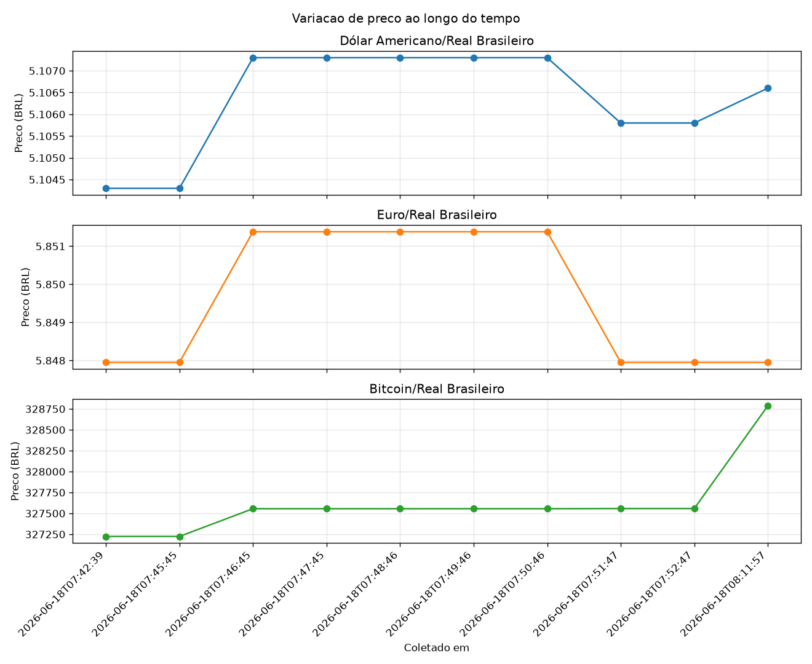

# ETL de Ofertas — Monitor de Preços

Pipeline ETL didático em Python que coleta preços de uma API pública, armazena o histórico em PostgreSQL e gera relatório e gráfico de variação ao longo do tempo.

Projeto construído de forma incremental: comecou em SQLite e foi migrado para PostgreSQL, reaproveitando quase todo o codigo SQL.

## O que faz

- Extract: busca cotações em tempo real na AwesomeAPI (dólar, euro e bitcoin em reais).
- Transform: limpa o JSON da API, mantendo apenas produto, preço e moeda.
- Load: grava cada coleta no PostgreSQL com carimbo de data/hora.
- Relatório: consultas SQL (mín./máx./média e variação com window function) e gráfico com matplotlib.

A fonte de dados é facilmente substituível: trocando apenas a etapa de extração, o mesmo pipeline serve para preços de produtos via API ou scraping.

## Estrutura

    etl-ofertas/
    ├── charts/              # graficos gerados
    ├── src/
    │   ├── db.py            # conexao (psycopg) + criacao da tabela e indice
    │   ├── extract.py       # etapa E/T: busca e limpa os dados da API
    │   ├── load.py          # etapa L: grava no PostgreSQL
    │   ├── main.py          # orquestra a coleta (E + T + L)
    │   ├── report.py        # relatorio + grafico
    │   └── sql.py           # utilitario para rodar consultas SQL ad-hoc
    └── requirements.txt

## Pré-requisitos

PostgreSQL instalado e rodando. Crie o banco e o usuário:

    sudo -u postgres psql
    CREATE USER adalton WITH PASSWORD 'sua_senha';
    CREATE DATABASE etl_ofertas OWNER adalton;
    \q

## Como rodar

    git clone https://github.com/adaltonvieira/etl-ofertas.git
    cd etl-ofertas
    python3 -m venv venv
    source venv/bin/activate
    pip install -r requirements.txt

Crie um arquivo `.env` na raiz com suas credenciais:

    DB_HOST=localhost
    DB_NAME=etl_ofertas
    DB_USER=adalton
    DB_PASSWORD=sua_senha

Rode o pipeline:

    python src/main.py     # coleta precos (rode varias vezes para acumular historico)
    python src/report.py   # gera relatorio e grafico

## Exemplo de saida

## Exemplo de consulta SQL

Variacao de preco entre uma coleta e a anterior (window function):

    python src/sql.py "SELECT produto, coletado_em, preco, ROUND((preco - LAG(preco) OVER (PARTITION BY produto ORDER BY coletado_em))::numeric, 4) AS variacao FROM precos ORDER BY produto, coletado_em"

## Tecnologias

Python, PostgreSQL, psycopg, python-dotenv, matplotlib

## Proximos passos

- API REST com FastAPI por cima do banco.
- Busca semantica de produtos com embeddings (pgvector / Chroma).
